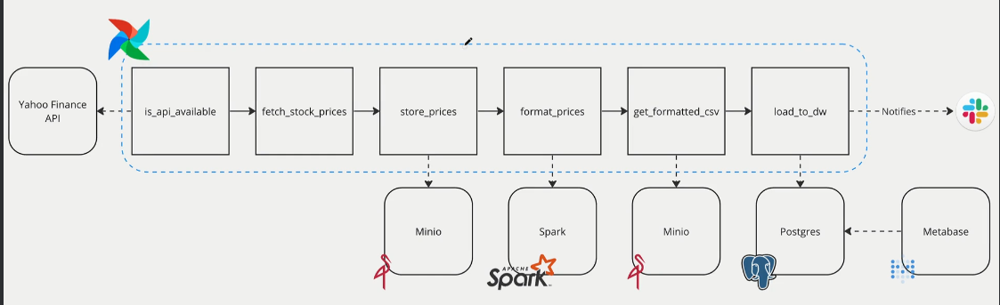

# Stock Price Pipeline with Airflow, MinIO, Spark, PostgreSQL, and Metabase

This repository contains an Airflow DAG that orchestrates a data pipeline for fetching, processing, and storing stock prices. The pipeline integrates with various tools and services, including Yahoo Finance API, MinIO, Apache Spark, PostgreSQL with notifications sent via Slack.

## Overview
The pipeline follows these steps:

1. `Check API Availability (is_api_available)`: Verifies that the Yahoo Finance API is accessible before proceeding.

2. `Fetch Stock Prices (fetch_stock_prices)`: Retrieves stock prices from Yahoo Finance API.

3. `Store Prices (store_prices)`: Stores the raw stock prices in a MinIO bucket.

4. `Format Prices (format_prices)`: A Spark job formats the raw stock prices.

5. `Get Formatted CSV (get_formatted_csv)`: The formatted prices are stored back into MinIO as a CSV file.

6. `Load to Data Warehouse (load_to_dw)`: The formatted CSV file is loaded into a PostgreSQL data warehouse.

7. `Slack Notifications`: The pipeline sends notifications to a Slack channel upon completion or failure.

# Architecture

* `Airflow`: Orchestrates the entire pipeline.
* `Yahoo Finance API`: Source of stock prices.
* `MinIO`: Object storage for raw and formatted data.
* `Apache Spark`: Processes and formats the raw data.
* `PostgreSQL`: Data warehouse where the formatted data is stored.
* `Slack`: Used for notifications.

# Prerequisites
* Docker
* Docker Compose
* Apache Airflow
* MinIO
* Apache Spark
* PostgreSQL
* Slack API

# Setup

#### 1. Clone the repository:

bash
```
git clone https://github.com/rohitkhazanchi121/stock-price-analysis-airflow.git
```

#### 2. Set up environment variables:

All credential to connect to airflow UI, Postgres, minio are defined in docker-compose.yaml.

#### 3. Build and run Docker containers
```
docker-compose up -d --build
```

#### 4. Access Airflow:

Airflow's web UI will be available at http://localhost:8080. Log in using the default credentials (airflow/airflow).

#### 5.Access Spark

Spark UI will be available at http://localhost:9090.

#### 5.Access Postgres

Can we accessed using IDE with Postgress connector, with host as localhost, port 5432. Username-password-database (airflow-airflow-airflow)

or from command line using

`docker exec -it <<postgres-container-name>> psql -U airflow` 

#### 7. Trigger the DAG:

Trigger the stock_market DAG from the Airflow UI to start the process.

# Project Structure
* dags/: Contains the Airflow DAG definition.
* include/: Custom Python scripts used in the pipeline.
* docker-compose.yml: Docker Compose file to set up the environment.
* Dockerfile: Dockerfile for building custom images.
* config/: Configuration files and environment variables.
* README.md: Project documentation.


# Usage
After setting up the environment, you can:

Monitor the DAG execution via Airflow's web UI.
View the processed data in PostgreSQL.
Receive notifications in Slack.